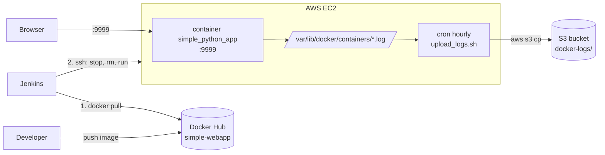

# Automated Deployment with S3 Logs

A small Python web app (Bottle + SQLite) packaged in Docker, deployed to an AWS EC2 instance by a Jenkins pipeline over SSH, with Docker container logs shipped to S3 on an hourly cron job.

The application in `app-code/` is the upstream demo [simple-python-website](https://github.com/darumor/simple-python-website); the DevOps work in this repo is the Dockerfile, the Jenkins pipeline and the log-shipping scripts.

## Architecture



## Stack

| Concern | Tool |
|---|---|
| App | Python 3.9, Bottle, SQLite |
| Packaging | Docker (`docker/Dockerfile`) |
| CD | Jenkins declarative pipeline (`jenkins/Jenkinfile`), SSH agent |
| Hosting | AWS EC2 |
| Log storage | AWS S3 via AWS CLI + cron |
| CI checks | GitHub Actions: compileall, hadolint, shellcheck, image build + smoke test, Trivy |

## Quick start (local)

The Dockerfile expects the app directory as the build context:

```bash
git clone https://github.com/frenzyali/Automated-Deployment-With-S3-Logs.git
cd Automated-Deployment-With-S3-Logs
docker build -f docker/Dockerfile -t simple-webapp app-code
docker run -d --name simple_python_app -p 9999:9999 \
  -e SPW_COOKIE_SECRET="$(openssl rand -hex 16)" \
  -e SPW_PASSWORD_SECRET="$(openssl rand -hex 16)" \
  simple-webapp
```

Open http://localhost:9999.

## Deploy to EC2 with Jenkins

1. Add an SSH private key credential to Jenkins with ID `ec2-ssh-key`.
2. Create a Pipeline job that uses `jenkins/Jenkinfile` as its script path (the file name has no "s").
3. Edit the pipeline's image name and EC2 host/user to your own. The EC2 security group must allow inbound TCP 9999.
4. Run the job. It pulls the image, then over SSH stops and removes the old container and starts the new one on port 9999.

## Ship logs to S3

On the EC2 host, with the AWS CLI installed and an instance role that allows `s3:PutObject` on the bucket:

```bash
sudo cp scripts/upload_logs.sh /opt/upload_logs.sh
sudo sed -i 's|<YOUR BUCKET NAME>|my-log-bucket|' /opt/upload_logs.sh
# edit scripts/setup_cronjob.sh so the path points at /opt/upload_logs.sh, then:
bash scripts/setup_cronjob.sh
```

The cron entry runs hourly and copies every `*.log` under `/var/lib/docker/containers/` to `s3://<bucket>/docker-logs/`. Reading that directory needs root, so install the cron job in root's crontab.

## Design decisions

- **Image built outside the pipeline.** Jenkins only pulls and deploys a pre-built Docker Hub image, which keeps the deploy job fast and the artefact identical across environments. GitHub Actions in this repo builds and smoke-tests the same Dockerfile on every push.
- **Replace-in-place deploy.** The pipeline stops, removes and re-runs a single named container: simple, with brief downtime on each deploy.
- **Logs come from Docker's own log files.** No app changes are needed, and an instance role avoids storing AWS keys on the host.
- **Trivy is report-only.** HIGH/CRITICAL findings are printed without failing the build until they have been triaged.

## Known limitations

- The Dockerfile bakes placeholder values for `SPW_COOKIE_SECRET` and `SPW_PASSWORD_SECRET` into the image. Always override them at `docker run` time as shown above.
- The container start command deletes `data/database.db` on every start, so the app's data does not persist across restarts.
- The Jenkins pipeline uses `StrictHostKeyChecking=no` and has the EC2 address and Docker Hub image hardcoded.
- `setup_cronjob.sh` appends a new cron entry each time it runs and contains a placeholder script path; `upload_logs.sh` contains a placeholder bucket name.
- The demo app hashes passwords with MD5 (its own README says it is not for production). The only credentials in the repo are its test fixtures (`admin` / `admin-password`).

## Cleanup

```bash
# on EC2
docker rm -f simple_python_app
crontab -e                   # remove the upload_logs.sh line
aws s3 rm s3://<bucket>/docker-logs/ --recursive
aws s3 rb s3://<bucket>      # only if the bucket was created for this project
# then terminate the EC2 instance and delete the Jenkins credential and Docker Hub image if unused
```
